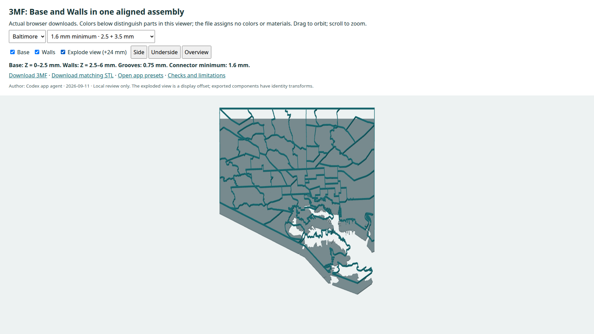

# 3MF parts and independent dimensions

Author: Codex app agent · 2026-09-11.

Implemented from clean `main` at `0bf194b`. Local joint review only; no push or deployment. Existing frozen geography and island evidence were reused.

[Working app](http://127.0.0.1:8765/app.html) · [Frozen app presets](http://127.0.0.1:8765/diagnostics/review.html) · [Downloaded 3MF part viewer](http://127.0.0.1:8765/diagnostics/3mf-review.html?city=baltimore&case=minimum-1.6)

## Controls and behavior

The former `depth` control is replaced by **Base height (mm)** and **Wall height above base (mm)**. Both default to 6; saved legacy `depth` populates both. Faces, connection pads and hull backing share the base top. Wall width remains independently configurable. The actual fixed XY extent remains 200 mm, and the unused legacy scale field is visibly disabled and labeled accordingly. STL has no units: import it as mm.

**Minimum connector width (mm)** defaults to 1.2 at the established 0.5 mm wall width. Its dimensional scale controls broad-pad spans, compact fallbacks, shoreline search distances, burial depth, continuous contact, backing and narrowest neck. Contact must be at least the greater of the chosen minimum and 65% of the candidate span; penetration must be at least one quarter of the minimum. The finite search may reject a feasible connection it does not find. Failure never relaxes the minimum or fills an inlet. Disconnected and Hull base remain recovery options.

Grooves retain their original semantics: cut upward from the underside through **30% of the chosen base height**, leaving **70%** above. They do not follow wall height. Heights and widths must be finite and between 0.01 and 200 mm; rounded layer levels must remain strictly increasing. The applied-value readback states base, added wall height, total height, groove depth, remaining floor and connector minimum.

Create applies height/minimum edits in place; mode changes apply pending edits together. These rebuilds preserve the camera and reuse prepared geography. Height-only changes also reuse planar regions. Geography/simplification/wall-width edits retain the existing preprocessing reload because topology simplification depends on wall width. Settings persist, and either editing inputs or a failed build disables both exports. The historical CSG comparison route is outside these new planar controls/3MF semantics; no historical CSG regeneration was performed.

## Package and geometry

The browser builds a ZIP with pinned, unmodified **fflate 0.8.2**, vendored with its MIT license and hashes (89,198 bytes of ESM source). No npm runtime install, server conversion or upload is involved. No ZIP/3MF implementation already existed in the repository.

The package contains `[Content_Types].xml`, `_rels/.rels`, and `3D/3dmodel.model`. It declares **millimeter** units and has:

- Mesh object 1, **Base**: full floors, underside grooves and the selected pads or hull backing, from Z=0 to the base height.
- Mesh object 2, **Walls**: all raised geographic lines, from the base height to base + wall height, with closed bottom and top caps.
- Component object 3, **Geographic model**: references Base and Walls with identity transforms.
- Exactly one build item referencing object 3, also with identity transform.

The two parts share the interface plane and have no overlapping volume. STL still uses the separately generated unified watertight surface, with no internal interface caps. All three meshes pass production topology and volume validation before download is enabled.

This follows [3MF Core objects, components and build semantics](https://github.com/3MFConsortium/spec_core/blob/997b385e06f3181cf9aae0c578e0b45ccd48ccb2/3MF%20Core%20Specification.md): components must retain their relative positions. Package XML also passed the unmodified official Core 1.4 appendix XSD. The exporter uses only the established Core namespace, with no private slicer extension or material/color properties. [PrusaSlicer 2.9.4 importer source](https://github.com/prusa3d/PrusaSlicer/blob/version_2.9.4/src/libslic3r/Format/3mf.cpp) was inspected for component transforms and object names. Its importer recursively expands component aliases, so UI behavior and assignment workflows remain consumer-dependent. No suitable installed slicer was found: **actual slicer import/recognition and material assignment have not been tested**.



[Side height evidence](results/dimensions/baltimore-side.png) · [Base underside and grooves](results/dimensions/baltimore-base-underside.png) · [Walls underside/interface caps](results/dimensions/baltimore-walls-underside.png) · [DC part separation](results/dimensions/dc-exploded.png). Viewer colors and the optional 24 mm explosion are display choices; exported parts retain identity transforms.

## Verification

`npm test` passes, including focused minimum-width/height checks and the retained C/U concave-shore, hairline, corner, tiny notch, central-hole, floor and community-boundary regressions. A 4 mm minimum rejects the small synthetic island that accepts the old fallback; both alternate modes remain valid. Explicit minimum tests also verify independence from wall width and a positive penetration threshold.

Actual browser runs downloaded **both STL and 3MF for nine cases per city**: all three default modes, lower base only, lower walls independently, stricter feasible minimum, both alternate modes at changed dimensions, and a saved-settings reload. The UI also tested zero base height, negative wall height, an out-of-range minimum, Baltimore's infeasible 20 mm minimum, camera preservation, orbit/zoom, zero idle frames and recovery. A separate injected startup/rebuild failure test passed.

Python `zipfile` and XML parsing independently check CRCs, content types, relationships, resource order/references, names, units, transforms and one assembly/build item. Actual named-part and STL meshes pass oriented edge incidence, manifold vertex fans, positive volume and bounds. Slices taken through every height interval agree between assembly, STL and expected planar regions within the existing Float32 boundary budget. Full base tops, groove roofs, bed faces, and both wall interface caps are verified. Certified continuous patches/backing and necks are measured with Shapely against pad/base intersections and actual downloaded floor occupancy. Pads leave inlets open.

**All six default STL downloads are byte-identical to the retained `0bf194b` evidence.** All 55 Baltimore and eight DC community anchors remain enclosed separately, with no mixed/newly unowned compartments. For changed settings, actual raised footprints match the established source-derived walls; full floors, central-void behavior and underside occupancy remain intact. No re-investigation or modification of source geography was needed.

The 1.6 mm Baltimore minimum changes the actual supports. The measured three necks are **3.53766, 5.33333 and 2.53333 mm**; the smallest continuous contact is **2.22208 mm**, and the smallest penetration is **0.46154 mm**, above the required 0.4 mm. A 20 mm minimum fails visibly. DC is a single island and requires no pad.

| Downloaded case | Base Z | Walls Z | Groove depth | Base / Walls / STL triangles |
|---|---|---|---|---|
| Baltimore default connections | 0–6 | 6–12 | 1.8 | 18,468 / 21,532 / 36,922 |
| Baltimore minimum 1.6, changed heights | 0–2.5 | 2.5–6 | 0.75 | 18,426 / 21,532 / 36,896 |
| DC default connections | 0–6 | 6–12 | 1.8 | 4,414 / 4,832 / 8,654 |
| DC minimum 1.6, changed heights | 0–2.5 | 2.5–6 | 0.75 | 4,414 / 4,832 / 8,654 |

At the changed heights, 1.75 mm of floor remains above the grooves. Part volumes sum to the corresponding STL volume within 0.0001 mm³ in these runs. The maximum measured section difference from the double-precision planar footprint was 0.005298 mm² (Baltimore) and 0.001251 mm² (DC), within the retained 2e-5 mm boundary tolerance; independent tessellations need not share triangle bytes.

| Actual single run | DC | Baltimore |
|---|---:|---:|
| Initial model, including validated parts | 4.190 s | 13.113 s |
| Base-height rebuild via UI | 0.631 s | 2.184 s |
| Wall-height rebuild via UI | 0.652 s | 1.999 s |
| Stricter 1.6 mm minimum rebuild via UI | 0.775 s | 4.818 s |
| Complete bounded browser harness | 42.505 s | 135.777 s |

These are measurements, not performance promises. The harness totals include both downloads, all modes, changed dimensions, screenshots, failures/recovery and reload. Mesh bounds and attachment tests are geometric criteria, **not print-strength guarantees**. No physical print/load test was performed. Rescaling in a slicer changes these dimensions.

## Reproduce this scope

```sh
npm test
ISLAND_CHECK=1 THREEMF_CHECK=1 UI_CHECK=1 LIMIT_SECONDS=150 node diagnostics/run.mjs optimized dc dimensions-dc
ISLAND_CHECK=1 THREEMF_CHECK=1 UI_CHECK=1 LIMIT_SECONDS=210 node diagnostics/run.mjs optimized baltimore dimensions-baltimore
FAIL_ISLAND=1 LIMIT_SECONDS=45 node diagnostics/run.mjs optimized dc dimensions-failure-recovery
timeout 150s python3 diagnostics/3mf-evidence.py dc
timeout 240s python3 diagnostics/3mf-evidence.py baltimore
python3 -m pip install --target .tmp/3mf-python xmlschema==4.1.0
timeout 90s python3 diagnostics/3mf-schema.py
timeout 45s node diagnostics/3mf-capture.mjs
```

The schema command caches pinned official sources in the repo and validates all 18 packages. libxml2 rejected the official XSD's large `maxOccurs` during compilation; switching to XMLSchema handled that limit without editing the schema. Raw meshes remain local/ignored, as in the existing workflow. Selected summaries and views are committed. The geometry audit rejects stale production-source hashes. The capture command uses the existing repo HTTP server at `127.0.0.1:8765`.

[DC package/geometry evidence](results/dimensions/evidence-dc.json) · [Baltimore package/geometry evidence](results/dimensions/evidence-baltimore.json) · [Official schema results and input hashes](results/dimensions/schema.json)
