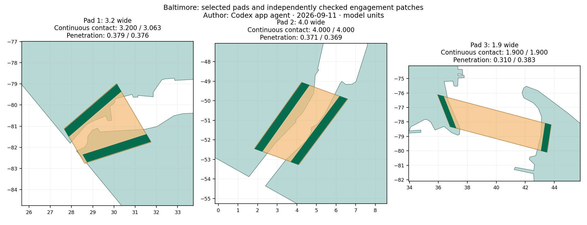
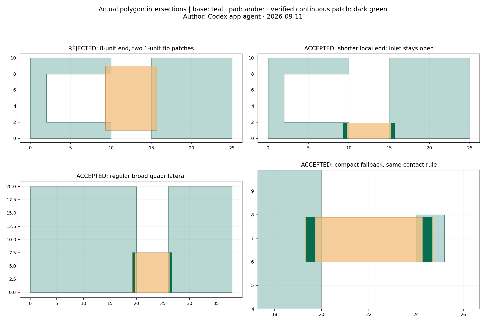

# Filled island bases and continuous pad engagement

Author: Codex app agent · 2026-09-11.

Continued the existing dirty implementation from `a08e47c` after Carlos interrupted the previous writer. Carlos's latest requirement is continuous broad engagement with **each filled base**, including concave shores; endpoint separation, total area and manifoldness alone are insufficient. No leftover harness was running. Existing frozen inputs and community acceptance artifacts were reused; no historical CSG investigation was repeated. Local commit/review only; no push or deployment.

[Interactive downloaded-STL review](http://127.0.0.1:8765/diagnostics/island-review.html) · [DC](http://127.0.0.1:8765/diagnostics/island-review.html?city=dc) · [Frozen app presets](review.html)

## Result and selection

Every retained exterior has a full floor, including the established floor beneath source voids. Disconnected keeps the geographic components separate. Connections is the default and adds bed-grounded solids from Z=0 to the base height (6 at these settings). Hull base fills the convex hull. Raised community footprints and ownership remain unchanged; underside grooves remain. Pure mode changes rebuild in place and preserve the camera.

The pad search prefers broad convex quadrilaterals along nearby shores. It searches local shifts/orientations, then shorter spans under the **same** dimensional rule. It skips infeasible edges when constructing the connecting tree. Baltimore's former 2.04382-unit nearest gap failed the new checks; the third link now uses a different local shore pair with a 4.11575-unit nearest gap. No corner-pocket or inlet-fill postprocessing remains. All selected pads add only 18.71156 square model units beyond the filled island bases.

At width=0.5 the nominal connection width is 2. Each end must contain a continuous patch at least `max(1.2, 65% of pad span)` wide and 0.3 deep, measured perpendicular to its shore chord. A deeper continuous band must also remain inside the source base beyond the buried pad end. Exact polygon subtraction and projection of every missing interval determine the usable patch; no spaced samples or aggregate-area shortcut. The convex pad's minimum neck must be at least 1.2. Bands and dimensions are retained in `regions.json` and independently checked with Shapely against the actual pad/base intersection and downloaded floor.

| Baltimore link | Pad span / neck | Continuous widths, both ends | Penetrations, both ends | Smallest width / depth margin |
|---|---:|---:|---:|---:|
| Shore pad 1 | 3.2 / 3.2 | 3.19996 / 3.06274 | 0.37871 / 0.37572 | +0.98274 / +0.07572 |
| Shore pad 2 | 4.0 / 4.0 | 3.99996 / 3.99996 | 0.37135 / 0.36896 | +1.39996 / +0.06896 |
| Local fallback | 1.9 / 1.9 | 1.89996 / 1.89996 | 0.31049 / 0.38264 | +0.66496 / +0.01049 |



These are **model units**: the existing app still normalizes XY to 200, despite the older `scaleToThisSize (cm)` control. This task preserves that behavior. STL is unitless; values correspond to mm only when imported as mm. The bands are geometric acceptance criteria, not a mechanical strength rating. No print/load test was performed; material, extrusion, orientation, rescaling and pre-existing slender geography still matter. A finite local search can reject a feasible shape it does not find. Features below the geometric minimum fail explicitly; they are not silently connected by a hairline. The mode selector remains usable and stale downloads stay disabled after failure.

## Verified evidence

`npm test` passes, including the focused C/U adversary: an 8-unit pad end overlaps only two 1-unit tips, passes the old area threshold and can form a closed connected mesh, but fails engagement. A connected hairline between those tips, a corner overlap and a 0.0002-unit notch also fail. A shorter C-shore attachment keeps the inlet open. Regular broad quadrilateral and compact fallback pass; a 0.3×0.4 feature and a thin pointed feature fail explicitly. Existing floor, cap, central-hole and community checks are preserved.



Actual UI downloads for all six city/mode combinations pass oriented edge incidence, manifold vertex fans, positive volume, connectivity, full-floor occupancy, support Z=0/6, and preview/download surface equality. Baltimore has 4 components in Disconnected and 1 in each other mode; DC has 1 throughout, so Connections adds no pad there. Raised planar footprints are identical to the retained `community-local-*` results. The STL floor/wall footprint checks use the existing 2e-5-unit Float32 boundary budget: maximum missing-floor area is 0.000591 square units and maximum wall difference from the double-precision footprint is 0.005297 square units, within that budget. Changed pad junctions can retriangulate wall faces; triangle-byte equality is not claimed.

All 55 Baltimore and 8 DC original community anchors remain separately enclosed. No mixed or newly unowned compartments, no ambiguous source overlap inside closed compartments, and no reintroduced known processing pockets. The Baltimore central source-void floor remains occupied without a raised wall at its interior point. Top and underside views of every Baltimore pad and both whole models were inspected. The pads have broad flat ends; geography-derived wall shapes and grooves remain visible. The fallback crosses a longer local gap instead of using the rejected nearest tip.

| Dataset | Initial geometry | Connections rebuild: planar + mesh | Complete harness, including exports/views/UI | Triangles: Connections / Disconnected / Hull |
|---|---:|---:|---:|---:|
| Baltimore | 13.853 s | 3.242 + 0.844 s | 73.184 s | 36,922 / 36,906 / 31,130 |
| DC | 4.154 s | 0.149 + 0.217 s | 22.072 s | 8,654 / 8,654 / 7,558 |

These are actual single-run times, not promises. Both UI runs verify all three labels, fresh Connections default, switching back, camera preservation, working orbit/zoom and zero idle frames. An injected engagement failure verifies recovery from failed startup to Disconnected and from failed rebuild to Hull, with stale Download disabled. The first recovery-harness attempt raced a document reload; adding a null-safe wait fixed the harness, and the rerun passed.

## Reproduce only this scope

```sh
npm test
node --import ./diagnostics/register.mjs diagnostics/island-check.mjs --evidence
ISLAND_CHECK=1 UI_CHECK=1 LIMIT_SECONDS=150 node diagnostics/run.mjs optimized baltimore island-pads-baltimore
ISLAND_CHECK=1 UI_CHECK=1 LIMIT_SECONDS=100 node diagnostics/run.mjs optimized dc island-pads-dc
FAIL_ISLAND=1 LIMIT_SECONDS=45 node diagnostics/run.mjs optimized dc island-failure-recovery
python3 diagnostics/island-evidence.py
node diagnostics/island-capture.mjs
```

The capture command uses the existing repo HTTP server at `127.0.0.1:8765` (or start `python3 -m http.server 8765 --bind 127.0.0.1` in the repo). Raw STLs/geometry remain local and ignored as before; selected summaries, acceptance results, diagrams and screenshots are committed. The evidence script rejects stale production source hashes. `FAIL_ISLAND` injects only a diagnostic failure into served code; production has no test flag. No new runtime dependency.
