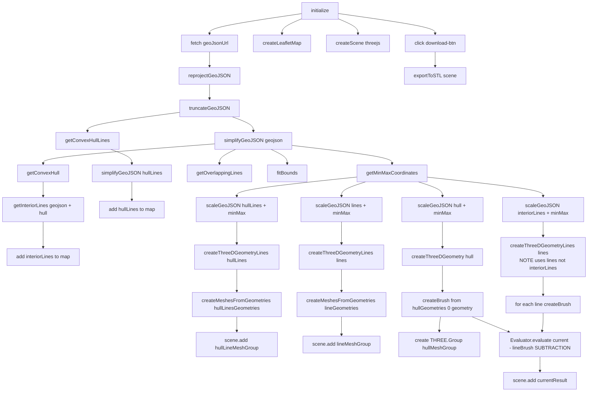

# SHP2STL

> Converts shapefiles to stl files

index.html - homepage
demo.html - of 3D Boolean Algebra. a proper subtraction demonstration using three-bvh-csg 
new.html - The app

leaflet.js - convenience functions.

Using Markdown Preview Mermaid Support VSCode Extension

## App process (end-to-end)

This documents what `new.html` + `new/new.js` currently do, in order, including the **3D build + CSG** portion.

### 0) Entry point (`new.html`)
- Loads Leaflet, Turf, TopoJSON libs from CDNs.
- Sets up an import map for `three` + `three-bvh-csg`.
- Imports `initialize()` from `./new/new.js` and runs it.

---

NA. Reproject lat/lng to center the shp
1. Turf.Truncate and Dedupe
2. TopoJson.Simplify
3. Hull/ Hull Lines = turf.union  + minArea Filter
4. Overlapping Lines = turf.lineOverlap
5. Interior Lines = OverlappingLines - HullLines
6. Recenter around the midpoint and Scale

## 1) `initialize()` (high level)
### 1.1 Runtime config
`window.shpstl` defines:
- `depth`: extrusion depth for solids (and basis for line cutters)
- `width`: thickness used to build line “cutters”
- `simplifyBy`: simplification for main GeoJSON
- `simplifyHullBy`: simplification for hull outline
- `geoJsonUrl`: source GeoJSON URL

### 1.2 Fetch → preprocess
1. Fetch GeoJSON from `geoJsonUrl`.
2. `reprojectGeoJSON(geojson)`
   - Converts lat/lng into a local 2D coordinate space centered on the dataset.
3. `truncateGeoJSON(geojson)`
   - Rounds coords to fixed decimals and attempts to dedupe in MultiPolygons (reduces noise / repeated points).
4. Build hull outline first:
   - `hullLines = getConvexHullLines(geojson)`
   - `hullLines = await simplifyGeoJSON(hullLines, simplifyHullBy)`
5. Topojson Simplify the main data:
   - `geojson = await simplifyGeoJSON(geojson, simplifyBy)`
6. Derive working geometry sets:
   - `hull = getConvexHull(geojson)` (actually a union/merge + filtering, not a mathematical convex hull)
   - `lines = getOverlappingLines(geojson)` (shared borders between polygons)
   - `interiorLines = getInteriorLines(geojson, hull)` (filters overlap lines away from hull boundary)

---

## 2) 2D rendering (Leaflet)
1. `createLeafletMap()` creates the map + OSM base layer.
2. Adds:
   - `hullLines` in red
   - `interiorLines` in green-ish
3. Fits map to `geojson` bounds:
   - `bounds = L.geoJSON(unproject(geojson)).getBounds()`
   - `map.fitBounds(bounds)`

---

## 3) Scaling reference (important)

### 3.1 `minMax = getMinMaxCoordinates(geojson)`
- Scans the (simplified + reprojected) `geojson` and returns `{ minX, minY, maxX, maxY }`.
- This is used as the **single reference box** so every layer (hull, hullLines, overlap lines, interior lines) gets scaled into the same normalized coordinate space.

### 3.2 `scaleGeoJSON(...)` (used repeatedly)
`scaleGeoJSON(geojsonLike, minMax)`:
- Recenters coords around the dataset’s midpoint
- Scales uniformly to preserve the aspect ratio:
  - `scale = finalSize (200cm) / max(width, height)`
- **Mutates the GeoJSON in-place**.

---

## 4) 3D rendering (Three.js)
### 4.1 Scene setup
- `createScene("threejs")` creates:
  - `scene`, `camera`, `renderer`, `OrbitControls`
  - basic ambient + directional lighting
  - an animation loop rendering continuously

### 4.2 Hull (solid extruded polygons)
1. `scaleGeoJSON(hull, minMax)`
2. `hullGeometries = createThreeDGeometry(hull)`
   - Converts polygon rings → `THREE.Shape()`
   - Extrudes each shape using `THREE.ExtrudeGeometry` with:
     - `depth: window.shpstl.depth`
     - `bevelEnabled: false`
3. Builds a `hullMeshGroup` of meshes via `createMesh(geometry)`.

**Note:** `hullMeshGroup` is currently **not added to the scene**. The hull you end up seeing is mainly the **CSG result mesh** added later.

### 4.3 Hull outline lines (extruded along path)
1. `scaleGeoJSON(hullLines, minMax)`
2. `hullLinesGeometries = createThreeDGeometryLines(hullLines)`
   - For each `LineString`, builds a `THREE.CurvePath()` from segments.
   - Extrudes a small rectangular shape along that path (`extrudePath`).
3. `hullLineMeshGroup = createMeshesFromGeometries(hullLinesGeometries)`
4. `hullLineMeshGroup.scale.set(1, 1, 2)` (makes them 2× in Z)
5. `scene.add(hullLineMeshGroup)`

### 4.4 Overlapping boundary lines (extruded) as “cutters/visuals”
1. `scaleGeoJSON(lines, minMax)`
2. `lineGeometries = createThreeDGeometryLines(lines)`
3. `lineMeshGroup = createMeshesFromGeometries(lineGeometries)`
4. `lineMeshGroup.position.z = window.shpstl.depth`
5. `scene.add(lineMeshGroup)`

### 4.5 Interior lines (intended cutters)
1. `scaleGeoJSON(interiorLines, minMax)`
2. `interiorlineGeometries = createThreeDGeometryLines(lines)`

**Important:** this currently extrudes `lines` again (not `interiorLines`). So the “interior line geometries” are duplicates of the overlap lines set.

---

## 5) CSG subtraction (three-bvh-csg)
Goal: subtract (extruded) line volumes from the hull to “engrave”/cut grooves.

### 5.1 Setup
- `hullBrush = createBrush(hullGeometries[0].geometry)`
- `currentResult = hullBrush`

**Important:** only `hullGeometries[0]` is used. If the hull produces multiple extruded geometries, only the first participates in CSG.

### 5.2 Loop: subtract each line brush
For each index `i`:
1. `lineGeometry = lineGeometries[i].clone()`
2. `lineBrush = createBrush(lineGeometry)`
3. `lineBrush.scale.set(1, 1, 0.3)` (shallower cut depth)
4. `currentResult = evaluator.evaluate(currentResult, lineBrush, SUBTRACTION)`

The resulting mesh (`currentResult`) is added to the scene:
- `scene.add(currentResult)`

---

## 6) STL export
- Clicking `#download-btn` calls `exportToSTL(scene)`.
- `STLExporter` serializes the scene to binary STL and triggers a download as `geojson_model.stl`.

---

## Known quirks (current behavior)
- `hullMeshGroup` is created but not added to the scene.
- `interiorlineGeometries` are generated from `lines` instead of `interiorLines`.
- CSG only uses `hullGeometries[0]`, ignoring additional hull parts.
- `scaleGeoJSON` mutates inputs, so order of operations matters if you reuse GeoJSON objects later.
